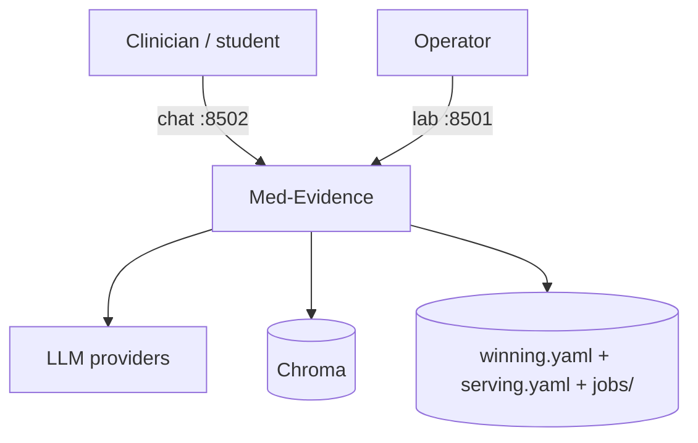
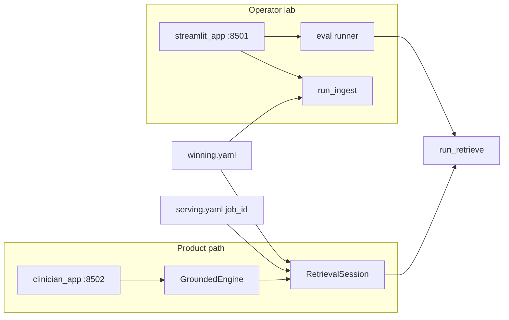
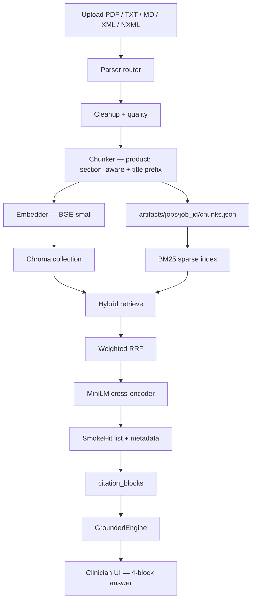
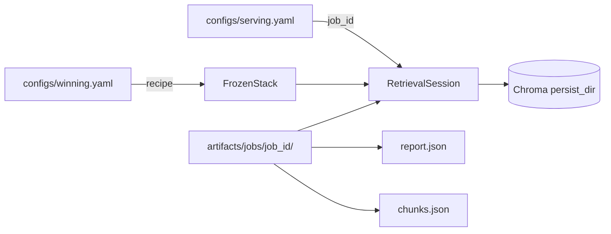
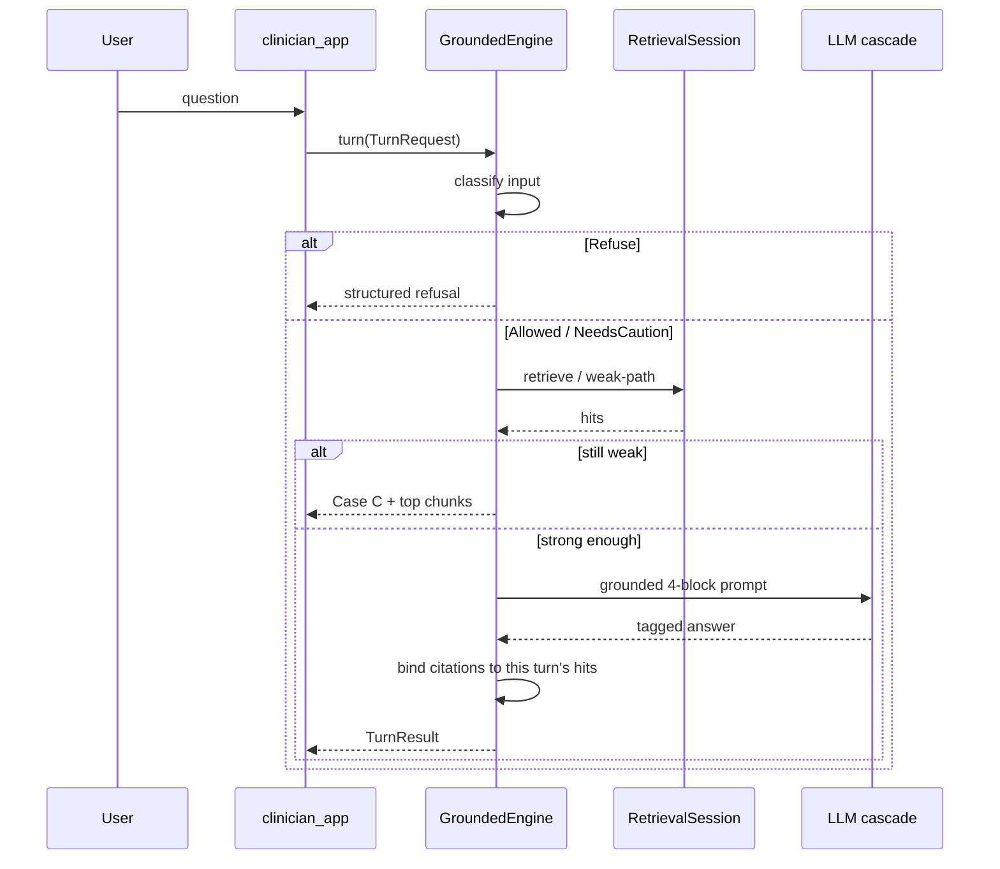

# Architecture

Med-Evidence is a clinician / student pharmacology guide: **document-agnostic ingest**, **frozen hybrid retrieval**, and **grounded generation** in a separate chat app. The operator Streamlit lab is ingest/eval only — not the product UI.

## System context

## Two processes, one package

| App | Entry | Port | Role |
| --- | --- | --- | --- |
| Clinician | `src/clinical_rag/ui/clinician_app.py` | 8502 | Query + grounded generation |
| Operator lab | `src/clinical_rag/ui/streamlit_app.py` | 8501 | Ingest, retrieval eval, smoke query |

Both import `clinical_rag`. The clinician app must not import `eval.grid` or retune `configs/winning.yaml`.

## End-to-end data flow

## Package map

| Package | Responsibility |
| --- | --- |
| `clinical_rag.parsing` | Media-type router, PDF/OCR, XML/NXML, text/JSON |
| `clinical_rag.chunking` | Lab strategies; product uses `section_aware` |
| `clinical_rag.indexing` | Embed + Chroma / Qdrant stores |
| `clinical_rag.retrieval` | Dense, BM25, RRF, rerank; lab-only sibling/parent |
| `clinical_rag.pipeline` | `run_ingest`, smoke query |
| `clinical_rag.stack` | `FrozenStack` from `winning.yaml` + serving pointer |
| `clinical_rag.query` | `RetrievalSession`, `citation_blocks` |
| `clinical_rag.generate` | Guardrails, weak retrieve path, prompts, `GroundedEngine` |
| `clinical_rag.adapters` | Embedders, stores, LLM cascade |
| `clinical_rag.eval` | Lab metrics and freeze — not product UI |
| `clinical_rag.ui` | Two Streamlit apps |

**Import rule:** product code loads the stack via `FrozenStack` / `RetrievalSession`, calls one ranker (`run_retrieve`), and always prompts with citation metadata — never bare strings.

## Config and artifacts

| Path | Meaning |
| --- | --- |
| `configs/winning.yaml` | Locked parser / chunk / embed / store / retrieve knobs |
| `configs/serving.yaml` | Machine-local `job_id` (copy from `serving.example.yaml`) |
| `artifacts/jobs/<job_id>/` | Ingest report, chunks, collection pointer |
| `data/eval/statpearls_pharmacology_templates.jsonl` | Official gold templates |
| `.env` | API keys and `GENERATION__*` knobs (not committed) |

## Product turn (clinician)

## Contracts (two, on purpose)

1. **Ingest / retrieve** accept any supported upload format.
2. **Official evaluation** scores StatPearls pharmacology only.

Full bakeoff: [evaluation.md](evaluation.md). Engineering contract and knobs: [technical-report.md](technical-report.md). How to run the apps: [user-guide.md](user-guide.md).
