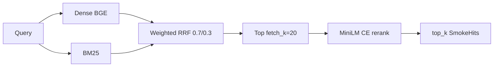
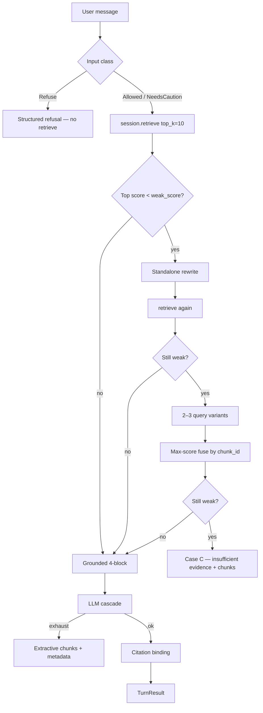
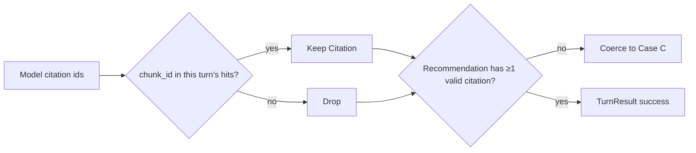

# Technical report

Engineering contract for Med-Evidence: frozen retrieval, grounded generation, configs, and failure modes. Retrieval is **not** retuned from the clinician path. Bakeoff evidence: [evaluation.md](evaluation.md). Layout diagrams: [architecture.md](architecture.md).

## Frozen stack

| Knob | Locked value |
| --- | --- |
| Parser | PyMuPDF / `ocr_fallback` (NXML via XML router) |
| Chunk | `section_aware`, 400 tokens, 12% overlap, max 520, **`prefix_section_title: true`** |
| Embed | `BAAI/bge-small-en-v1.5` (Sentence Transformers) |
| Store | Chroma (on-disk, cosine) |
| Retrieve | Hybrid BM25, weights **0.7 / 0.3**, RRF k=60, `fetch_k=20` |
| Rerank | `cross-encoder/ms-marco-MiniLM-L-6-v2` on fused top 20, **CPU** |
| Off | `sibling_fill`, `parent_child` |

Source of truth: [`configs/winning.yaml`](../configs/winning.yaml). Product lock eval run: `4a2bf096b370` (MRR = P@1 = Hit@5 = 1.0, P@5 = 0.35, nDCG@5 = 0.951).

Do not re-run `scripts/lock_winning_combo.py` unless you intend to reset the bakeoff winner (prefix **off**).

## Hybrid retrieval

`run_retrieve` is the only ranking function. `RetrievalSession` holds embedder, BM25, Chroma, and the cross-encoder so UIs do not wire them.



Each hit carries `document_name`, `section_title`, `page_number`, `chunk_id`, and score. Prompt context is built with `citation_blocks(hits)` — never bare passage strings alone.

### Session load

```python
from clinical_rag.query import RetrievalSession, citation_blocks

session = RetrievalSession.open()  # winning.yaml + serving.yaml
hits = session.retrieve(user_question)
context = citation_blocks(hits)
```

`winning.yaml` is the recipe. The live collection is a **local ingest job**:

1. Copy [`configs/serving.example.yaml`](../configs/serving.example.yaml) → `configs/serving.yaml`.
2. Set `job_id` to a directory under `artifacts/jobs/` built with the frozen stack (title-prefix).
3. On the freeze machine that job is `ae69f99b47b7`.

Pass `job_id=` to `RetrievalSession.open(...)` to override.

### Lab-only (off on product path)

`sibling_fill` and `parent_child` exist under `clinical_rag.retrieval` for experiments. Both are **false** in `winning.yaml`. Enabling them in product without a new labeled eval violates the stack lock.

## Generation contract

Fail closed. No LangChain LCEL. No HyDE.

```python
from clinical_rag.adapters.llms import build_cascade
from clinical_rag.generate import GroundedEngine, TurnRequest
from clinical_rag.query import RetrievalSession

session = RetrievalSession.open()
llm = build_cascade()  # Gemini → OpenAI → Groq → Anthropic → local → exhaust
engine = GroundedEngine(session, llm)
result = engine.turn(TurnRequest(message=user_question, history=prior_turns))
```

### Per-turn pipeline



| Step | Behavior |
| --- | --- |
| Classify | Keywords first; optional cheap LLM. Classes: `Allowed`, `NeedsCaution`, `Refuse`. |
| Refuse | Structured refusal, **no retrieve**, empty evidence. |
| Retrieve | Frozen `session.retrieve` (`top_k=10`). |
| Weak gate | Empty hits or `hits[0].score < GENERATION__WEAK_SCORE` (default **0.35**). Scores are sigmoid CE logits in `(0,1)`. |
| Rewrite | Standalone question from history + message → retrieve again. |
| Multi-query | 2–3 variants → retrieve each → **fuse by `chunk_id`, keep max CE score** (not RRF — RRF would destroy CE scores and break the gate). |
| Case C | Insufficient-evidence copy; show top chunks; **no** Recommendation. |
| Generate | Tagged 4-block from `citation_blocks(hits[:prompt_k])` (`prompt_k` default **5**). |
| Cascade exhaust | Extractive ranked chunks + metadata; no prose Recommendation. |

Citations and hits are **this turn only**. Last `memory_turns` (default 6) user/assistant pairs go to the LLM as dialogue context, never as a substitute for retrieve.

### Answer shape (4-block)

Tagged sections the model must emit:

1. **Recommendation** — educational pharmacology answer  
2. **Evidence** — short quotes tied to retrieved windows  
3. **Citations** — `chunk_id` / document / section from this turn  
4. **Confidence** — `high` | `medium` | `low` | `insufficient`

### Citation binding



Unbound `chunk_id`s are dropped. A Recommendation with zero valid citations is coerced to Case C.

### Generation metrics (clinician UI)

Per-turn heuristics — **not** a labeled generation bakeoff:

| Metric | Definition | Range |
| --- | --- | --- |
| **Faithfulness** | Mean over recommendation **claims** of max claim-support score vs retrieved hits (combined + per-hit). Default scorer: product MiniLM CE (`ms-marco-MiniLM-L-6-v2`, sigmoid). | **0–1** continuous |
| **Citation accuracy** | Strict: unique model ``chunk_id=`` / ``[n]`` proposals that bind *as written*. An explicit wrong ``chunk_id=`` counts as a miss even if ``[n]`` still rescues the answer panel. Auto-fill → **N/A**. | **0–1** or N/A |

Session generation means average **grounded turns only** (excludes refusal and Case C / extractive).


Hard entailment rate (share of claims with P ≥ 0.5) is shown in the turn expander caption.

### LLM cascade

Order: **Gemini → OpenAI → Groq → Anthropic → local OpenAI-compatible → exhaust**. First available client with a working key wins per call; exhaustion triggers extractive fallback. Models and local base URL are under `Settings.generation` / `GENERATION__*` (see [`.env.example`](../.env.example)).

## Module cheat sheet

| Need | Call |
| --- | --- |
| Load stack | `clinical_rag.stack.load_frozen_stack` → `FrozenStack` |
| Query | `RetrievalSession.open().retrieve(question)` |
| Prompt citations | `citation_blocks(hits)` |
| Grounded turn | `GroundedEngine(session, llm).turn(TurnRequest(...))` |
| Rebuild index | `stack.ingest_config(...)` then `clinical_rag.pipeline.run_ingest` |
| Eval (lab only) | `clinical_rag.eval` — not from the clinician UI |

## Configuration

| Source | Contents |
| --- | --- |
| `configs/winning.yaml` | Locked ingest + retrieve recipe |
| `configs/serving.yaml` | Local `job_id` only |
| `.env` | Secrets + optional `GENERATION__WEAK_SCORE`, `PROMPT_K`, `MEMORY_TURNS`, model ids |
| `Settings` (`clinical_rag.config`) | Nested pydantic settings; `env_nested_delimiter="__"` |

## Scripts

| Script | Use |
| --- | --- |
| `scripts/retrieve.py` | CLI smoke retrieve against serving job |
| `scripts/build_index.py` | Build an ingest job |
| `scripts/run_retrieval_eval.py` | Score a job against gold templates |
| `scripts/lock_winning_combo.py` | **Danger** — rewrites `winning.yaml` to bakeoff winner |

## Failure modes (fail closed)

| Condition | Product behavior |
| --- | --- |
| Missing `serving.yaml` / job / `chunks.json` | `IngestError` — do not invent an index |
| Empty query | Error — no silent default |
| Unsafe / out-of-scope input | Refusal, no retrieve |
| Weak retrieval after rewrite + multi-query | Case C + chunks |
| All LLM providers fail | Extractive fallback |
| Hallucinated citation ids | Dropped; zero left → Case C |
| Gold template matches zero chunks at label time | Eval/ingest fails closed |

## Testing

```bash
uv run pytest
```

Generation tests stub the LLM and retrieval path. Retrieval/unit tests cover RRF, sparse, chunking, metrics, and session load without retuning the frozen stack.
