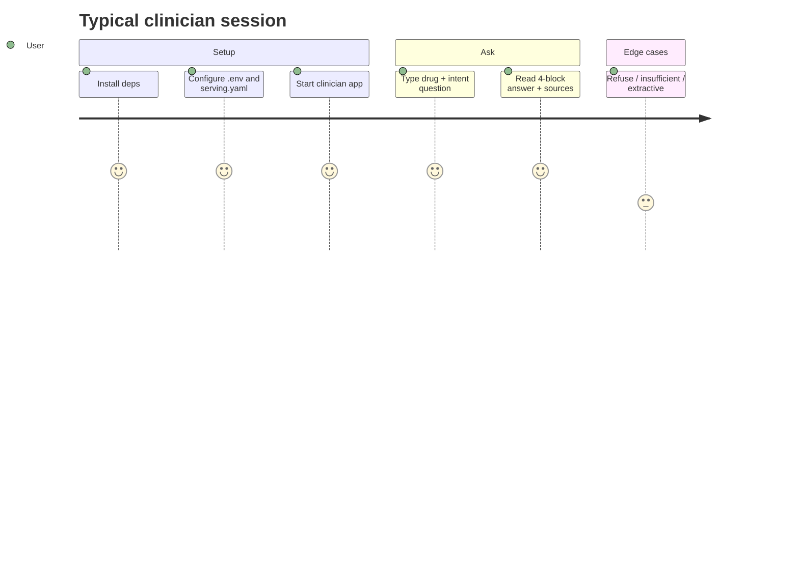
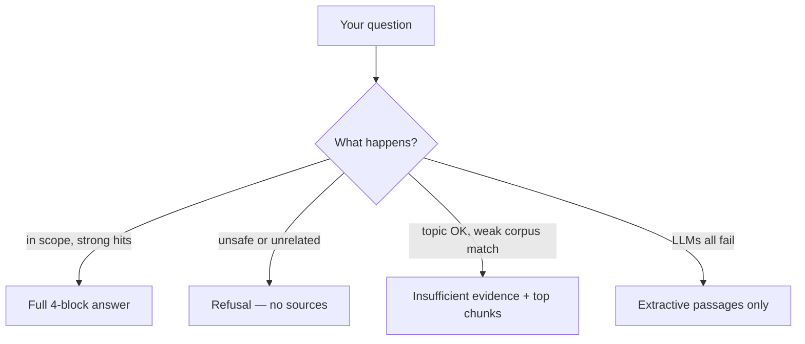

# User guide

How to set up Med-Evidence and use both apps. Educational pharmacology only — not diagnosis, prescribing, or emergency care.

## What you get

| Audience | App | Port | Purpose |
| --- | --- | --- | --- |
| Clinician / student | Clinician chat | **8502** | Ask drug questions; get grounded answers with citations |
| Operator | Lab | **8501** | Ingest documents, inspect the frozen stack, run retrieval eval |

Retrieval is locked. Do not treat the lab as the product chat.



## Setup

### 1. Install

```bash
# Clinician app (retrieval + generation)
uv sync --extra generate --extra dev

# Lab only (ingest / eval)
uv sync --extra dev
```

Python **3.11–3.13**. GPU helps embeddings; the cross-encoder reranker runs on **CPU** in the locked stack.

### 2. Secrets

```bash
cp .env.example .env
```

Set at least one LLM key (or run a local OpenAI-compatible server). Generation tries providers in order: Gemini → OpenAI → Groq → Anthropic → local. Optional knobs:

```bash
# GENERATION__WEAK_SCORE=0.35
# GENERATION__PROMPT_K=5
# GENERATION__MEMORY_TURNS=6
```

### 3. Serving pointer

```bash
cp configs/serving.example.yaml configs/serving.yaml
```

Set `job_id` to an ingest under `artifacts/jobs/` that was built with the frozen stack (`section_aware` + title prefix). Example on the freeze machine: `ae69f99b47b7`.

### 4. Data (eval / StatPearls)

Gold templates: `data/eval/statpearls_pharmacology_templates.jsonl`.

StatPearls NXML is not committed — symlink `data/pharmacology_data` → your local dump if you rebuild the index.

## Clinician app

```bash
uv run streamlit run src/clinical_rag/ui/clinician_app.py --server.address 127.0.0.1 --server.port 8502
```

Open http://127.0.0.1:8502.

### How to ask

Prefer **drug + clinical intent**, matching how monographs are sectioned:

- “What are the contraindications for Ampicillin?”
- “How is metoprolol monitored?”
- “What is the mechanism of action of amlodipine?”

Vague or non-pharmacology questions are refused or return weak evidence.

### What you see

| UI piece | Meaning |
| --- | --- |
| Recommendation | Educational answer grounded in retrieved passages |
| Evidence | Short quotes from those passages |
| Citations | Document, section, chunk ids from **this turn** |
| Confidence | high / medium / low / insufficient |
| Sources panel | Collapsed retrieved chunks with scores |
| Scorecard | Locked retrieval metrics (MRR, P@k, …) — not “this answer is medically correct” |
| Generation metrics | Claim-level faithfulness (0–1) and citation bind rate |
| Demo buttons | Random question from in-scope / refusal / out-of-corpus pools |
| Sidebar | Disclaimer and responsible-use notes |

### Outcome paths



| Path | You should |
| --- | --- |
| Full answer | Still verify against the primary reference and clinical judgment |
| Refusal | Rephrase to an educational pharmacology question, or use another resource |
| Insufficient evidence | Narrow the drug/section, or accept that the index may not cover it |
| Extractive | Read the passages; no model-written Recommendation was produced |

### Demo pools

- **In-scope** — from the StatPearls pharmacology gold templates  
- **Refusal** — weather, sports, coding, patient self-treatment, emergencies  
- **Out-of-corpus** — guidelines / screening topics the pharmacology index does not claim to answer  

## Operator lab

```bash
uv run streamlit run src/clinical_rag/ui/streamlit_app.py --server.address 127.0.0.1 --server.port 8501
```

Open http://127.0.0.1:8501.

Tabs cover **ingest**, **retrieval eval**, **try-query** (smoke), and a **winning.yaml** inspector. Use this to build or score an index — not as the clinician chat.

### CLI smoke retrieve

```bash
uv run python scripts/retrieve.py "What are the contraindications for Ampicillin?"
```

### Rebuild an index (operators)

1. Ingest with the frozen recipe (`FrozenStack.ingest_config` → `run_ingest`), or use the lab ingest tab.  
2. Point `configs/serving.yaml` at the new `job_id`.  
3. Confirm title-prefix chunking matches `winning.yaml` before treating it as the product index.

Do **not** change `winning.yaml` knobs without a new labeled eval (see [evaluation.md](evaluation.md)).

## Tests

```bash
uv run pytest
```

## Responsible use

- Educational use only — not a diagnosis, prescription, or emergency advice.  
- If this is an emergency, call local emergency services.  
- Corpus is oriented to **StatPearls pharmacology**; other specialties are out of scope for the official eval.  
- Always attribute document title and section when citing; verify against the full primary source.

More detail: [architecture.md](architecture.md), [technical-report.md](technical-report.md), [evaluation.md](evaluation.md).
